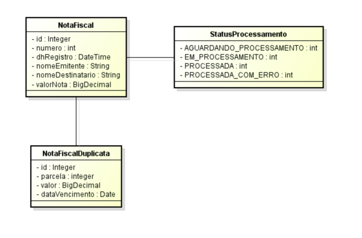
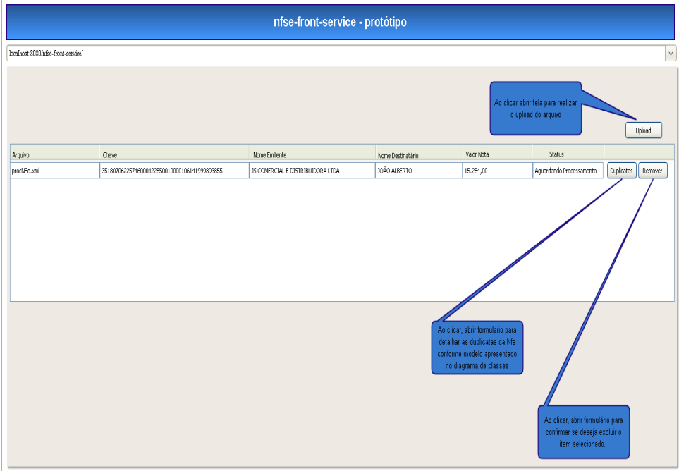

<p align="center">
  

  
  
  <a href="https://github.com/glaubermatos/jobscalc/commits/master">
    
  </a>
    
   
  
</p>

<h2 align="center">
    Aplicação para upload e processamento de arquivos xml de Notas Fiscais
</h2>


<h4 align="center"> 
	🚧  Aplicação em desenvolvimento! 🚧
</h4>

## 🏁 Tópicos

<p>
 👉<a href="#-sobre-o-projeto" style="text-decoration: none; "> Sobre</a> <br/>
👉<a href="#-funcionalidades" style="text-decoration: none; "> Funcionalidades</a> <br/>
👉<a href="#-tecnologias" style="text-decoration: none"> Tecnologias</a> <br/>
👉<a href="#-como-executar-o-projeto" style="text-decoration: none"> Como executar</a> <br/>
👉<a href="#-autor" style="text-decoration: none"> Autor</a> <br/>
👉<a href="#-user-content--licença" style="text-decoration: none"> Licença</a>

</p>

## 💻 Sobre o projeto

A aplicação tem como principal objetivo permitir o upload de Nota Fiscal, realizar a leitura do xml, fazer o bind com a estrutura de classes do domínio, processar e persistir em um banco de dados MySQL.

A proposta do projeto é ser desenvolvido seguindo modelo arquitetural de microservices onde terá 3 serviços distintos:

- **nfe-upload-service**: Aplicação responsável por recepcionar os arquivos;
- **nfe-process-service**: Aplicação responsável por processar os arquivos;
- **nfe-front-service**: aplicação responsável por apresentar a interface com o usuário.

### Diagrama de classes

<br />



<br />

### Protótipo

<br />



<br />

---

<a name="-funcionalidades"></a>

## ⚙️ Funcionalidades

<br />

- ### **nfe-upload-service**
    - O nfe-upload-service deverá expor um serviço para realizar o **upload do arquivo .xml** referente a nota fiscal eletrônica.
    - Após recepcionar o arquivo, o nfe-upload-service deverá **gravar o arquivo em disco no diretório input** e retornar uma mensagem para o cliente informando que o seu arquivo foi recepcionado com sucesso e que será processado.
    - Quando o **arquivo for enviado via upload**, a nota deverá conter o status de **AGUARDANDO_PROCESSAMENTO**

<br />

- ### **nfe-process-service**
    - O nfe-process-service, será **executado a cada 120 segundos**, ler o diretório input e processar os arquivos, se o arquivo foi **processado com sucesso mover para a pasta output**. Se o arquivo for **processado com falha mover o arquivo em processamento para o diretório error**.
    - Quando o nfs-process-service for executado a nota deverá ter o status de EM_PROCESSAMENTO, se a nota foi **processada com SUCESSO**, o status deverá ser **PROCESSADA**. Se a nota foi **processada com erro** a nota deverá ter o status **PROCESSADA_COM_ERRO**.

<br />

- ### **nfe-front-service**
    - O nfe-front-service deverá ser uma aplicação web simples (desejável utilizar um framework JS)
    - Deve **listar as notas fiscais já enviadas em um componente de tabela**
    - Ao clicar no botão Upload - **Abrir a tela para realizar o upload** do arquivo
    - Ao clicar no **botão Duplicatas** - **Abrir formulário para detalhar as duplicatas da Nfe**, conforme modelo apresentado no diagrama de classes
    - Ao clicar no **botão Remover** - Abrir formulário para **confirmar se deseja excluir** o item selecionado.

    <br />


---

<br />

## 🛠 Tecnologias

### **Back-end**
* Java 11
* Spring-boot
* JPA
* Spring Data JPA
* MySQL
* RabbitMQ
* Spring AMQP
* Spring Cloud Eureka Server
* Spring Cloud Eureka Client
* Spring Cloud Api Gateway
* jDom2

### **Front-end**
* Create React App
* ReactJS
* Typescript
* Primereact
* Axios

<br />

---

## 🚀 Como executar o projeto

### Pré-requisitos

Para executar o projeto é necessário ter instalado o [**Docker**](https://www.docker.com/get-started/) e [**Docker-componse**](https://docs.docker.com/compose/gettingstarted/) para subir o Banco de dados [MySQL](https://www.mysql.com/) e Serviço de Mensageria [RabbitMQ](https://www.rabbitmq.com/#getstarted)

<br />

Clonar repositório github - Necessário ter o git instalado.
```bash

git clone https://github.com/glaubermatos/upload-danfe-file.git

```

<br />

**Executando o MySQL e RabbitMQ com docker-compose**

Entre na pasta raiz do projeto e certifique-se que o arquivo docker-compose.yml esta presente e rode o comando docker-compose up, isso será o suficiente para que os serviços inicializem.

* Credenciais de acesso ao RabbitMQ

<br />

    - username: rabbitmq
    - password: rabbitmq

```bash

cd upload-danfe-file
sudo docker-compose up

```

<br />

**Executando os serviços**

**Backend**

Os passos a seguir desevem seguir a ordem especificada para evitar erros de comunicação entre os microserviços

<br />

**Eureka Server**

Entrar no diretório eureka-server e rodar o projeto

```bash

cd eureka-server
./mvnw spring-boot:run

```

<br />

**Serviço de upload de arquivo**

Entrar no diretório nfe-upload-service e rodar o projeto

```bash

cd nfe-upload-service
./mvnw spring-boot:run

```

<br />

**Serviço de processamento de arquivo**

Entrar no diretório nfe-process-service e rodar o projeto

```bash

cd nfe-process-service
./mvnw spring-boot:run

```

<br />

**Api Gateway**

Entrar no diretório api-gateway-server e rodar o projeto

```bash

cd api-gateway-server
./mvnw spring-boot:run

```

<br />

**Front-end**

Entrar no diretório nfe-front-service e rodar o projeto

```bash

cd nfe-front-service
yarn start

```
---

<br />

<a name="-autor"></a>

## 🦸‍♂️ **Autor**

<br />

<p>
 
 <br />
 <sub><strong>🌟 Glauber de Oliveira Matos 🌟</strong></sub>
</p>

[](https://www.linkedin.com/in/glaubermatos/)

---
<a name="-user-content--licença"></a>

## 📝 Licença

Este projeto esta sobe a licença [MIT](./LICENSE).

Feito com :satisfied: por Glauber de Oliveira Matos 👋🏽 [Entre em contato!](https://www.linkedin.com/in/glaubermatos/)
